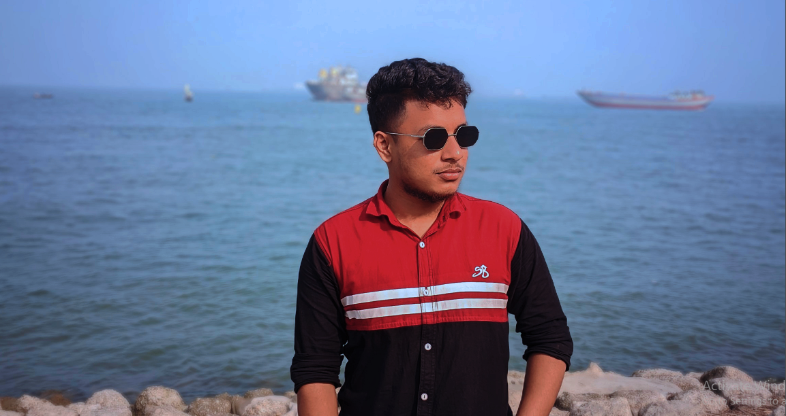

# Hi, I'm Mohammad Nayem
A full-stack MERN developer🌌  
🏠 Living in Bhola, Bangladesh  
 ## 👨‍🏫 About me
 🌟 Full-stack JavaScript Developer specializing in MERN stack
🚀 Passionate about building scalable web applications
💻 Experience with HTML, CSS, Bootstrap, JavaScript, React, Node.js, Express.js
🎓 Constantly learning and exploring new technologies to stay updated
📚 Graduatution on BSC in Chemistry from Bhola Govt. College
 ## 👨🏽‍💻 Skills:
 
 
 
 
   

 ## 🛠️ Tools:
  
    

**Others skills:**  

## 👨🏻‍🎓 Education
* Bsc (Bachelor of Science) - on going
* HSC (Higher Secondary School Certificate)
* SSC (Secondary School Certificate)

## Language
* Bangla (Native)  
* English (Intermediate)

## Sports
* 🏏 Cricket
* ⚽ Football
* 🏸 Badminton

## Activities
* </> Coding
*  🚶‍♂️ Walking

## Hobby
* ✈️ Travelling
* 🍦 Eating

## Connect with me:
 
 
 

